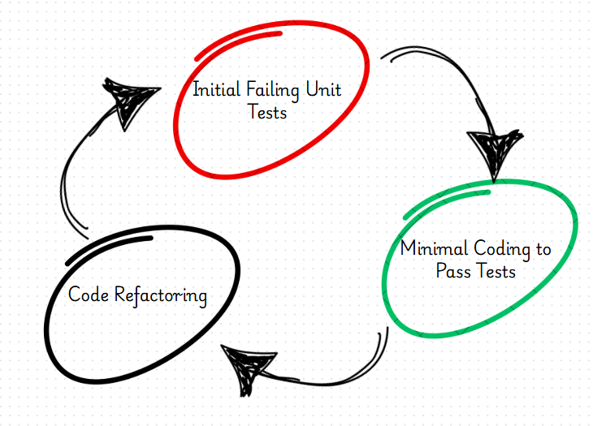
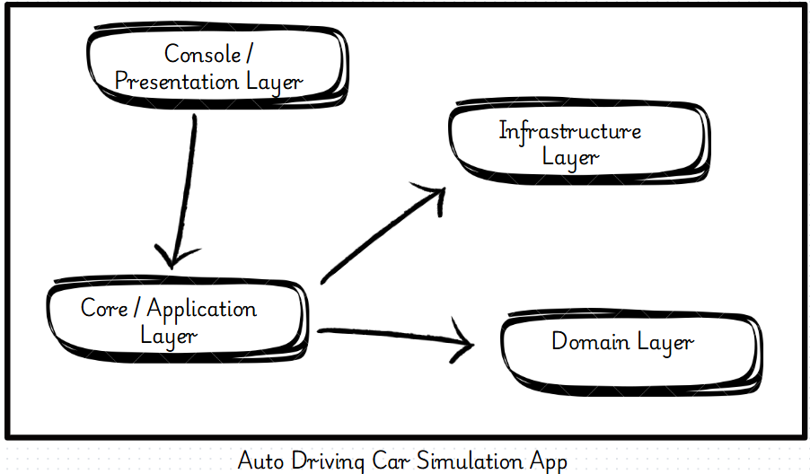
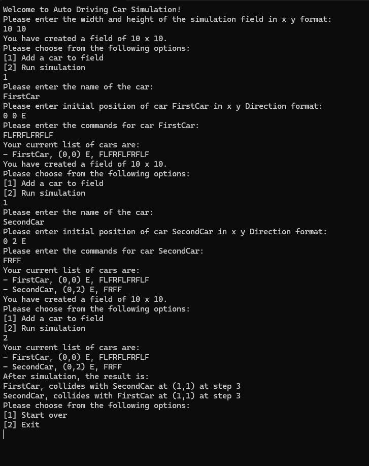

# Auto Driving Car Simulation

---

## This is all about creating a console application with C# .net core framework to simulate the behavior of autonomous car with the given instructions and custom constraints provided.

---

## Table of Contents

- [What is Auto Driving Car Simulation](#what-is-auto-driving-car-simulation)
- [Design and Architecture](#what-is-auto-driving-car-simulation)
- [How to Setup](#how-to-setup)
- [How it Works](#how-it-works)
- [Usage](#usage)
- [Testing](#testing)
- [What is next](#what-is-next)

---

## What is Auto Driving Car Simulation

- This application is a simulation framework designed to model the movement of autonomous vehicles based on a defined set of rules. The primary focus of the project is to simulate autonomous cars navigating within a predefined grid area, executing a sequence of instructions.
- Each car has a starting point and it is restricted to operate within the boundaries of the defined area. If an instruction attempts to move a car beyond these limits, the command is ignored, and the simulation proceeds with the next valid instruction.
- The simulation also supports multiple cars operating concurrently. In scenarios where two or more cars are instructed to move into the same position, a collision is detected. When a collision occurs, the affected cars are halted and excluded from further movement, while the remaining cars continue executing their instructions.
- At the conclusion of the simulation, the final positions of all cars are reported. Additionally, a detailed collision report is generated, including the location of each collision, the names of the involved cars, and the number of steps executed by each car prior to the collision.

---

## Design and Architecture

- This system was designed using a Test-Driven Development (TDD) approach with C# and .NET-core framework. Unit tests were written first using xUnit to cover all core business logic, ensuring robustness and maintainability from the outset.
  -The following design principles and practices were followed along with SOLID during development:

  - Scalability and Extensibility: The system is designed with scalability in mind, with the capability to integrate a database in the future using an ORM such as Entity Framework or Dapper.
  - Single Responsibility Principle: Each function and method adheres to the Single Responsibility Principle, and corresponding unit tests were written to validate individual functionalities.
  - Interface-Driven Design: Interfaces are used to facilitate future extensions with minimal code changes. New interfaces are created based on specific requirements rather than relying on a single, monolithic abstraction.
  - Dependency Injection: All dependencies are injected through interfaces without directly referencing concrete implementations, ensuring loose coupling between layers.

- A layered architecture was implemented in conjunction with TDD. Business logic is encapsulated within the Domain layer, while the Infrastructure layer handles data operations using in-memory lists. This structure allows seamless future integration with any database by updating only the Infrastructure layer.

- The TDD cycle was strictly followed: failing unit tests were written first using interfaces, followed by minimal code changes to pass the tests.
- Robust Input Validation: Comprehensive input validation was implemented to ensure a smooth user experience. Invalid inputs do not crash the application; instead, meaningful error messages are displayed, helping users understand and correct their input.
- Version Control Best Practices: Commits were made frequently with meaningful and descriptive messages. Each commit includes a reasonable amount of changes, making it easier for teams to collaborate and track progress effectively.
- FluentAssertions was used in unit testing to enable more readable and expressive assertions, enhancing the clarity and effectiveness of test result evaluations.
- NSubstitute was utilized to mock dependencies during unit test development, allowing for isolated testing of components and ensuring accurate verification of interactions.
- A dedicated test helper class was implemented within the unit test project to centralize the creation of mock data. This approach promotes reusability and consistency across multiple test cases.

---

## How to Setup

### Prerequisits

- .NET SDK 8.0 or later
- you can check the version by executing <pre> `dotnet --version` </pre>

### Cloning Repository

- Repository can be cloned using the following command or thought a thirdparty app like SourcrTree <pre> `git clone https://github.com/dasunkasthury/AutoDrivingCarSimulation.git` </pre> <pre> `cd AutoDrivingCarSimulation` </pre>

### Build the Project

- Use the following command or Visual Studio to build the project <pre> `dotnet build` </pre>

### Run the Application

- Use the following command or Visual Studio to run the project <pre> `dotnet run --project src/AutoDrivingCarSimulator` </pre>

- Following is an example workflow

---

## How it Works

### Getting Started

- Upon launching the application, you will be prompted to input the height and width of the field. These values must be positive integers—zero or negative values are not allowed.
- Once the field is defined, you will be presented with two options:

  1. Add a car to the field
  2. Run simulation

  - Note: You must add at least one car before starting the simulation. Attempting to run the simulation without any cars will prompt you to add a car first.

### Adding a Car

- When choosing to add a car, the application will guide you through the following steps:

  - Enter a unique name for the car.
  - Specify the car’s starting position (X, Y) within the grid and its initial direction (e.g., North, South, East, West).
  - Provide a command string that dictates the car’s movements.
    - If an invalid command is entered, you’ll be prompted to re-enter a valid one.

- After entering the car details, the car will be displayed on the grid. You can then choose to either:

  - Add another car, or
  - Proceed to run the simulation.

### Running the Simulation

- When you initiate the simulation:

  - Each car will begin executing its list of commands sequentially.

  - If a car attempts to move outside the defined grid, that command is ignored, and the simulation continues with the next instruction.

  - If two or more cars move to the same grid position at the same step, a collision is detected.

    - Collided cars will stop moving immediately and will not process any further commands.

    - The simulation continues for the rest of the cars.

## Output

- After the simulation completes, the application will display:

  - The final position and direction of each car.

  - A collision report, including:

    - The location of each collision.

    - The names of the cars involved.

    - The number of steps each car completed before the collision.

---

## Usage

- This console application can be used to simulate the movements of any kind of object and can be used to study the movements with the given instructions. Since the business logic is isolated from the implementation this solution can be easily customized with different constraints for any other use case.
- This is a good example for a clean structured code with coding standereds and best practices. So this can be used as a row model to study the concepts of software development like SOLID principles and OOP concepts.

---

## Testing

- Testing was initiated prior to actual implementation, as the project followed a Test-Driven Development (TDD) approach.
- Initially, failing unit tests were written based on abstractions, using interfaces to define expected behavior.
- Core business logic was fully covered by unit tests before implementation, with a strong focus on input-output validation to ensure correctness and reliability.

## What is next

- The solution has significant potential for enhancement by integrating it with a database, enabling the addition of more advanced and persistent functional features.
- Given the growing interest in simulation-based systems, this solution offers a strong foundation for various potential implementations and extensions in future development.
